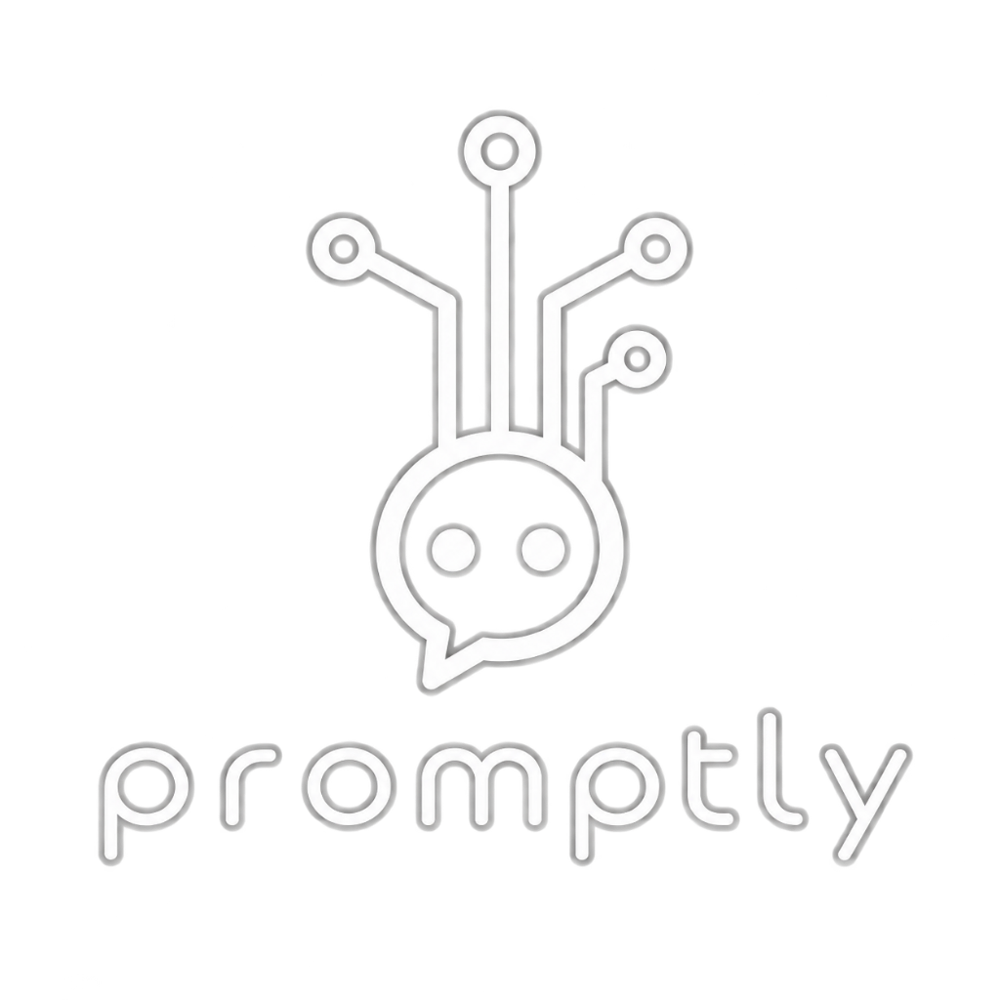
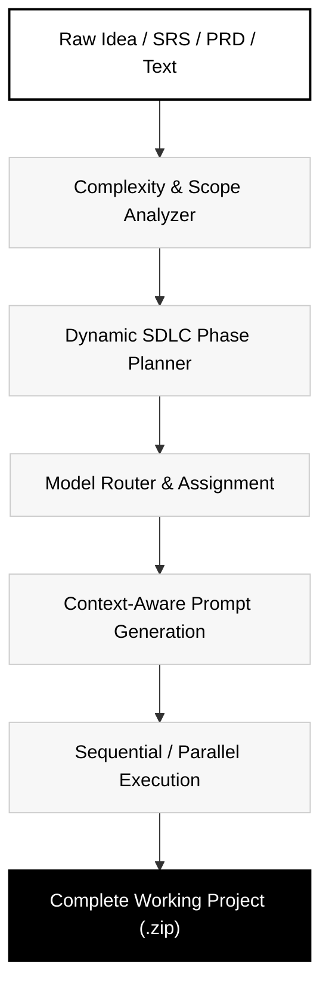
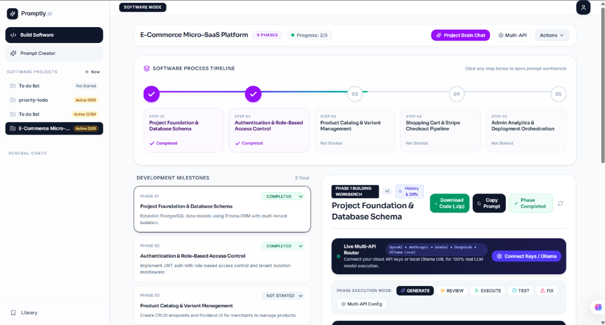
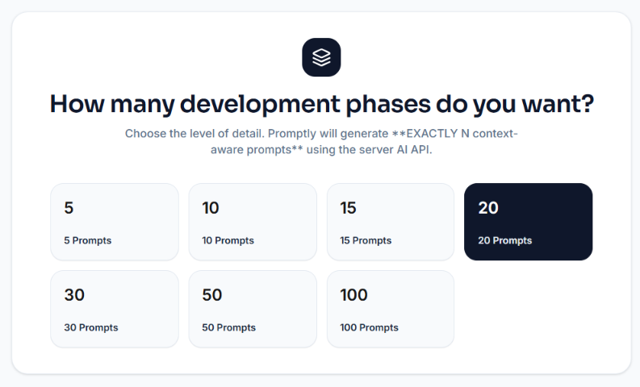
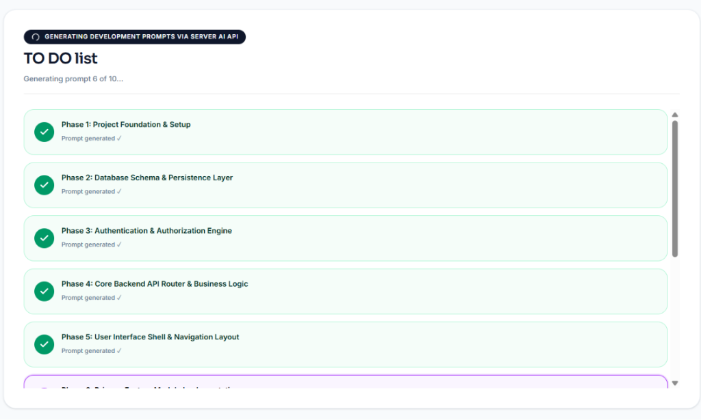
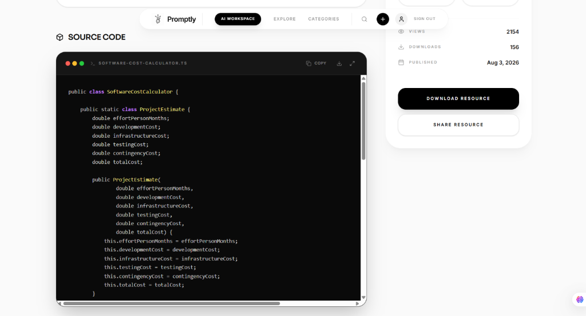

<p align="center">
  
</p>

<h1 align="center">promptly</h1>

<p align="center">
  <strong>Turn ideas into software, systematically.</strong>
</p>

<p align="center">
  AI-powered SDLC Architecture for turning software ideas into executable development workflows.
</p>

<p align="center">
  <a href="#how-promptly-works">Workflow</a> •
  <a href="#the-two-engines">Engines</a> •
  <a href="#architecture">Architecture</a> •
  <a href="#technology-stack">Tech Stack</a> •
  <a href="#getting-started">Getting Started</a> •
  <a href="docs/PITCH_DECK.md">Pitch Deck</a>
</p>

---

## The Problem

Every software product begins as an idea. However, the path from concept to working software is fragmented:

```
Requirements ──> Architecture ──> Development ──> Testing ──> Deployment ──> Evolution
```

- **Tool Fragmentation**: Ideas get scattered across PRDs, design boards, issue trackers, and ad-hoc chat sessions.
- **Context Decay**: As projects scale, AI code assistants lose architectural memory, resulting in incompatible code snippets and hallucinated integrations.
- **Unstructured Prompting**: Asking a single AI model to "build an entire app" fails because software development requires distinct, phased decisions rather than one-shot code generation.

---

## The Solution

**Promptly moves AI from code generation to software-development orchestration.**

Instead of treating AI as a conversational assistant or single code autocomplete tool, Promptly acts as an **AI-powered SDLC Architecture**. It digests specifications, assesses technical complexity, generates structured development phases, routes individual tasks to specialized models, and produces production-ready source code.

```
IDEA  ──>  STRUCTURED SDLC  ──>  ORCHESTRATED EXECUTION  ──>  WORKING SOFTWARE
```

---

## How Promptly Works

Promptly orchestrates the entire engineering lifecycle in a continuous pipeline:



---

## The Two Engines

Promptly is powered by two interconnected engines:

| Engine | Purpose | Core Output |
| :--- | :--- | :--- |
| **01. SDLC Engine** | Systematically transforms requirements into phase-planned, model-routed software builds. | Source code, architecture blueprints, database schemas, `.zip` exports. |
| **02. Community & Search Engine** | Global developer knowledge ecosystem where verified prompts, architectures, and snippets feed directly into active project builds. | Living project context, reusable modules, verified prompts. |

---

## Engine 01 — SDLC Engine

The SDLC Engine ingests specifications in any format (SRS, PRD, Markdown, plain text, or UI/UX mockups) and breaks them into executable milestones.

<p align="center">
  
</p>

### 1. Flexible Phase Granularity
Developers choose the exact milestone fidelity required for their project scale:
- **Rapid Prototyping**: 5 phases (Foundation, Auth, Core API, UI Shell, Deployment).
- **Production Applications**: 10 to 30 phases with granular domain separation.
- **Enterprise Architectures**: 50 to 100+ fine-grained, verifiable phases.

<p align="center">
  
</p>

### 2. Multi-Model Phase Assignment
Different phases require different reasoning capabilities. Promptly allows assigning models dynamically per phase:

```
Complex Domain Architecture  ──>  Claude 3.5 Sonnet / OpenAI o1
High-Throughput API Logic     ──>  DeepSeek V3 / GPT-4o
Fast Frontend Scaffold        ──>  Gemini 2.0 Flash
Local & Private Computes      ──>  Ollama (Llama 3 / Qwen)
```

<p align="center">
  
</p>

### 3. Execution & Export
- **Step-by-Step Workbench**: Review, generate, test, and fix each milestone sequentially or in parallel.
- **Project Brain Memory**: Maintains active constraints, verified schemas, and environment requirements across all phases.
- **One-Click Export**: Downloads the entire software repository with all source files, configurations, and scripts as a clean `.zip`.

---

## Engine 02 — Community + Search Engine

Promptly includes a searchable repository of community-verified building blocks that can be directly imported as context into the SDLC Engine:

```
DISCOVER  ──>  INSPECT  ──>  IMPORT TO CONTEXT  ──>  BUILD  ──>  SHARE
```

<p align="center">
  
</p>

- **Categorized Discovery**: Website Development, Mobile Apps, UI/UX, AI/ML, Data Science, and Automation.
- **Context Injection**: Import real architectures, prompts, and snippets into your project's Brain Memory to guide subsequent SDLC phases.
- **Creator Profiles**: Follow builders, curate collections, and track resource benchmarks.

---

## Unique Value Proposition

> **AI-Powered SDLC Architecture**
>
> Promptly orchestrates how software is planned, prompted, built, and evolved.

Unlike standard code-assistants that operate file-by-file or line-by-line without high-level awareness, Promptly provides an end-to-end engineering harness that bridges conceptual intent and production code.

---

## Innovation

- **Complexity-Adaptive SDLC Planning**: Automatically determines dependency trees and required milestones based on project scope.
- **Phase-Level Model Routing**: Eliminates model lock-in by matching cognitive task complexity to model strengths (reasoning vs. coding vs. speed).
- **Bidirectional Ecosystem Loop**: Community resources feed into project context, and completed project phases can be published back to the ecosystem.

---

## Category Positioning

Promptly defines a distinct category in the developer tool landscape:

| Category | Typical Tools | Primary Focus | Promptly Difference |
| :--- | :--- | :--- | :--- |
| **Conversational AI** | ChatGPT, Claude | Chat & unstructured Q&A | Promptly structures output into phased, verifiable software deliverables. |
| **AI Autocomplete** | GitHub Copilot, Cursor | In-editor code generation | Promptly orchestrates high-level SDLC planning and multi-phase execution. |
| **App Generators** | v0, Bolt.new | One-shot frontend prototypes | Promptly produces full-stack systems with custom phase granularity (up to 100+ phases). |
| **Promptly** | **Promptly Platform** | **Software Development Orchestration** | **Connects idea decomposition, model assignment, context memory, and execution.** |

---

## Technical Architecture

```mermaid
flowchart LR
    subgraph Engine_1 ["Engine 01: SDLC Engine"]
        UI["User Input / SRS / PRD"] --> CA["Complexity Analyzer"]
        CA --> PP["SDLC Phase Planner"]
        PP --> MR["Model Router (Multi-API)"]
        MR --> PG["Prompt Generation Engine"]
        PG --> EX["Execution Workbench"]
        EX --> AR["Project Artifacts & .zip"]
    end

    subgraph Memory ["Project Brain"]
        PB[("Persistent Context Store & ADRs")]
    end

    subgraph Engine_2 ["Engine 02: Community Engine"]
        CC["Community Resources"] --> SE["Search & Filter Engine"]
        SE --> CR["Verified Prompts & Snippets"]
    end

    CR -.->|"Inject Context"| PB
    PB <-->|"Shared State"| EX
    AR -.->|"Publish"| CC
```



---

## Technology Stack

The Promptly repository is built with a modern, high-performance TypeScript stack:

- **Framework**: [TanStack Start](https://tanstack.com/start) (Full-stack SSR / Streaming)
- **Frontend Core**: [React 19](https://react.dev/), [Vite](https://vitejs.dev/)
- **Routing & Data**: [TanStack Router](https://tanstack.com/router) (file-based routing), [TanStack Query](https://tanstack.com/query)
- **Styling & UI**: [Tailwind CSS v4](https://tailwindcss.com/), [Radix UI Primitives](https://www.radix-ui.com/), [Lucide Icons](https://lucide.dev/)
- **3D & Animation**: [Three.js](https://threejs.org/), [@react-three/fiber](https://docs.pmnd.rs/react-three-fiber), [Framer Motion](https://www.framer.com/motion/)
- **Backend & Persistence**: [Supabase](https://supabase.com/) (Auth, PostgreSQL, Storage)
- **AI Integrations**: OpenAI SDK, Anthropic SDK, Google Generative AI SDK, Multi-API Gateway router

---

## Project Structure

```
PROMPTLY/
├── docs/                      # Documentation, pitch deck, and visual assets
│   ├── assets/                # Screenshots and official brand assets
│   ├── branding/              # Reference brand mockups
│   ├── PITCH_DECK.md          # 9-slide investor & hackathon deck
│   └── SPECIFICATION.md       # Complete platform technical specification
├── public/                    # Static assets & public brand files
├── seeds/                     # Database seed data, migrations, and scripts
│   ├── chunks/                # Split migration chunks
│   ├── scripts/               # Seed generation and database utilities
│   └── *.sql                  # Production database initialization scripts
├── src/                       # Application source code
│   ├── assets/                # Internal application assets
│   ├── components/            # UI components and feature modules
│   │   ├── chat/              # Project brain chat drawer
│   │   ├── landing/           # Landing page, hero, and navigation
│   │   ├── prompt-creator/    # AI Prompt Studio workflow
│   │   ├── resource/          # Resource detail & code viewers
│   │   ├── resources/         # Resource cards and modals
│   │   ├── software/          # Multi-phase software creation workflow
│   │   └── ui/                # Radix + Tailwind design system primitives
│   ├── hooks/                 # React hooks (auth, auto-seed, responsive)
│   ├── integrations/          # Supabase & Lovable client connectors
│   ├── lib/                   # Orchestrator, multi-API router, prompt pipeline
│   ├── routes/                # TanStack file-based routes
│   │   ├── index.tsx          # Homepage with 3D Promptly Engine
│   │   ├── ai.tsx             # AI Workspace & Software Engine
│   │   ├── create.tsx         # Resource & prompt creation portal
│   │   ├── explore.tsx        # Resource catalog & discovery engine
│   │   ├── categories.tsx     # Categorized directory
│   │   ├── profile/           # Creator profiles ($username.tsx)
│   │   └── resources/         # Resource viewer ($id.tsx)
│   ├── router.tsx             # TanStack router bootstrap
│   ├── server.ts              # Server-side entry wrapper
│   └── styles.css             # Design tokens and Tailwind stylesheet
├── supabase/                  # Supabase local configuration & migrations
├── package.json               # Dependency definitions and scripts
├── tsconfig.json              # TypeScript configuration
└── vite.config.ts             # Vite + TanStack plugin pipeline
```

---

## Getting Started

### Prerequisites
- **Node.js**: `>= 20.0.0`
- **npm**: `>= 10.0.0`

### 1. Clone & Install

```bash
git clone https://github.com/sunilkumar2007/PROMPTLY.git
cd PROMPTLY
npm install
```

### 2. Configure Environment

Copy the example environment template and add your Supabase credentials:

```bash
cp .env.example .env
```

```env
SUPABASE_PROJECT_ID="your-project-id"
SUPABASE_PUBLISHABLE_KEY="your-publishable-key"
SUPABASE_URL="https://your-project-id.supabase.co"
VITE_SUPABASE_PROJECT_ID="your-project-id"
VITE_SUPABASE_PUBLISHABLE_KEY="your-publishable-key"
VITE_SUPABASE_URL="https://your-project-id.supabase.co"
```

### 3. Run Development Server

```bash
npm run dev
```

The application will be running locally at:
👉 **[http://localhost:8080](http://localhost:8080)**

### 4. Build for Production

```bash
npm run build
npm run preview
```

---

## Roadmap

- [x] 3D Promptly Particle Engine & Homepage Interface
- [x] Multi-phase SDLC decomposition (5 to 100+ phases)
- [x] Phase-level Multi-API Model Router (OpenAI, Anthropic, Gemini, DeepSeek)
- [x] Community Discovery Engine & Resource Catalog
- [x] Creator Profiles, Likes, and Follower System
- [x] Full Source Code & Project `.zip` Exporter
- [ ] Automated Git Repository push directly from completed execution
- [ ] Real-time browser test runner integration
- [ ] Webhook-based CI/CD triggers

---

## Contributing

Contributions to Promptly are welcome. Please ensure that all pull requests maintain clean TypeScript standards, pass type checking, and adhere to the project's minimalist monochrome design system.

1. Fork the repository
2. Create your feature branch (`git checkout -b feature/sdlc-enhancement`)
3. Commit your changes (`git commit -m "Add feature"`)
4. Push to the branch (`git push origin feature/sdlc-enhancement`)
5. Open a Pull Request

---

## License

This project is licensed under the [MIT License](LICENSE).
