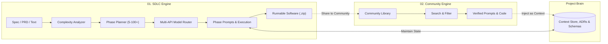

# Promptly — Hackathon & Investor Pitch Deck

<p align="center">
  
</p>

---

## Slide 1: Power Title & Tagline

### **promptly**
> **“Turn ideas into software, systematically.”**

**The AI-Powered SDLC Architecture Platform**  
*Moving AI from simple code generation to complete software-development orchestration.*

**Presenter:** Sunil Kumar  
**Live Platform:** [https://github.com/sunilkumar2007/PROMPTLY](https://github.com/sunilkumar2007/PROMPTLY)

---

## Slide 2: Problem Statement

### **Ideas are abundant. Building working software is broken.**

The journey from a software idea to a production-ready application is fragmented across disconnected stages:

```
[Idea / PRD]  ──>  [Architecture]  ──>  [Code]  ──>  [Tests]  ──>  [Deploy]
```

1. **Context Collapse**: Large language models forget earlier architectural decisions as codebases expand beyond single files.
2. **One-Shot Failure**: Asking an AI to "build an app" generates fragile, unintegrated prototypes with zero software lifecycle rigor.
3. **Tool Silos**: Developers manually juggle chat windows, terminal CLIs, documentation, and cloud dashboards with no unifying orchestration harness.

---

## Slide 3: Solution Overview

### **Promptly: The AI Software Development Lifecycle (SDLC) Engine**

Promptly combines disciplined software engineering methodology with multi-model AI intelligence.

```
IDEA  ──>  UNDERSTAND  ──>  ANALYZE COMPLEXITY  ──>  PLAN SDLC  ──>  ASSIGN MODELS  ──>  EXECUTE  ──>  SOFTWARE
```

- **Not an autocomplete**: Promptly is not an editor plugin or single-prompt generator.
- **Decomposition**: Analyzes PRDs, SRS docs, or plain text and splits them into 5 to 100+ verifiable development phases.
- **Cognitive Routing**: Pairs complex architectural phases with reasoning models and repetitive scaffold phases with fast code models.
- **Output**: Complete project repositories with runnable code, schemas, and configurations exported as `.zip`.

---

## Slide 4: System Architecture & Workflow

### **Two Connected Engines Powered by Living Context**



1. **SDLC Engine**: Orchestrates phase planning, API routing, code synthesis, and verification.
2. **Community Engine**: A global discovery platform where proven prompts and components feed directly into active project memory.

---

## Slide 5: Existing Solutions & Our Edge

### **Where Promptly Fits in the Developer Landscape**

| Dimension | AI Chatbots (ChatGPT / Claude) | Coding Assistants (Copilot / Cursor) | App Generators (v0 / Bolt) | **Promptly** |
| :--- | :--- | :--- | :--- | :--- |
| **Primary Scope** | Q&A & snippet generation | Line/file autocomplete | Frontend visual mocks | **End-to-end SDLC orchestration** |
| **Architectural Memory** | Lost after context window | Limited to local files | Limited to single prompt | **Persistent Project Brain & ADRs** |
| **Phase Granularity** | None (Single prompt) | File-by-file manual | Monolithic generation | **Adaptive: 5 to 100+ granular steps** |
| **Model Independence** | Locked to provider | Locked to provider | Single engine | **Dynamic multi-model per phase** |
| **Community Feed** | Isolated | None | Template gallery | **Two-way context injection loop** |

---

## Slide 6: Unique Value Proposition (UVP)

### **AI-Powered SDLC Architecture**

> *“Promptly orchestrates how software is planned, prompted, built, and evolved.”*

- **Autonomous yet Verifiable**: Gives developers granular control over every milestone before moving to the next.
- **Heterogeneous Intelligence**: Uses the right tool for the job—Claude 3.5 Sonnet for architecture, DeepSeek V3 for implementation, and Gemini Flash for rapid scaffolding.
- **Zero Lock-In**: Connects with cloud API providers (OpenAI, Anthropic, Google) and local private models (Ollama).

---

## Slide 7: Market Opportunity

### **Targeting the 30M+ Global Developer & Builder Market**

1. **Solo Founders & Indie Hackers**: Builders who have deep domain ideas but need systematic full-stack architecture support.
2. **Engineering Teams**: Development squads needing automated PRD-to-milestone decomposition and context-safe prompt plans.
3. **Agencies & Dev Shops**: Rapidly transforming customer specifications into production scaffolding without technical debt.

---

## Slide 8: Business Model

### **Monetizing Orchestration & Ecosystem Depth**

- **Developer Free Tier**:
  - Full access to Community Engine, search, and standard SDLC decomposition.
  - Bring-Your-Own-Key (BYOK) for LLM endpoints and local Ollama support.
- **Promptly Pro ($20/month)**:
  - Managed high-throughput multi-API ensemble router.
  - Unlimited 100+ phase granular project execution.
  - Cloud workspace persistence and instant GitHub repository synchronization.
- **Enterprise / Team**:
  - Private model deployment behind VPCs.
  - Custom organizational architectural rules, design systems, and compliance guardrails.

---

## Slide 9: Closing & Call to Action

### **Turn ideas into software, systematically.**

Promptly transforms the chaos of one-off prompting into an engineering discipline.

- **GitHub Repository**: [https://github.com/sunilkumar2007/PROMPTLY](https://github.com/sunilkumar2007/PROMPTLY)
- **Local Application**: [http://localhost:8080](http://localhost:8080)
- **Status**: Live working platform ready for exploration.

---
*Built with TanStack Start, React 19, TypeScript, and Tailwind CSS.*
